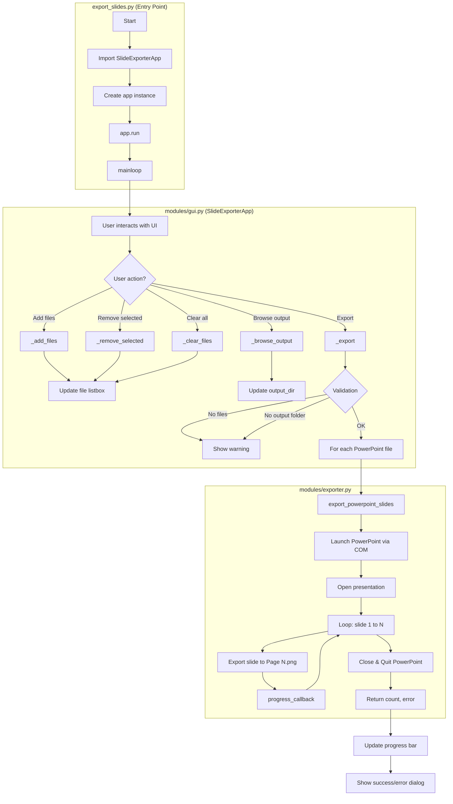

# PowerPoint Slide Exporter — Architecture & Flow

## Program Flow Diagram

```mermaid
flowchart TB
    subgraph Entry["export_slides.py (Entry Point)"]
        A[Start] --> B[Import SlideExporterApp]
        B --> C[Create app instance]
        C --> D[app.run]
        D --> E[mainloop]
    end

    subgraph GUI["modules/gui.py (SlideExporterApp)"]
        E --> F[User interacts with UI]
        F --> G{User action?}
        G -->|Add files| H[_add_files]
        G -->|Remove selected| I[_remove_selected]
        G -->|Clear all| J[_clear_files]
        G -->|Browse output| K[_browse_output]
        G -->|Export| L[_export]

        H --> M[Update file listbox]
        I --> M
        J --> M
        K --> N[Update output_dir]

        L --> O{Validation}
        O -->|No files| P[Show warning]
        O -->|No output folder| P
        O -->|OK| Q[For each PowerPoint file]
    end

    subgraph Exporter["modules/exporter.py"]
        Q --> R[export_powerpoint_slides]
        R --> S[Launch PowerPoint via COM]
        S --> T[Open presentation]
        T --> U[Loop: slide 1 to N]
        U --> V[Export slide to Page N.png]
        V --> W[progress_callback]
        W --> U
        U --> X[Close & Quit PowerPoint]
        X --> Y[Return count, error]
    end

    Y --> Z[Update progress bar]
    Z --> AA[Show success/error dialog]
```
