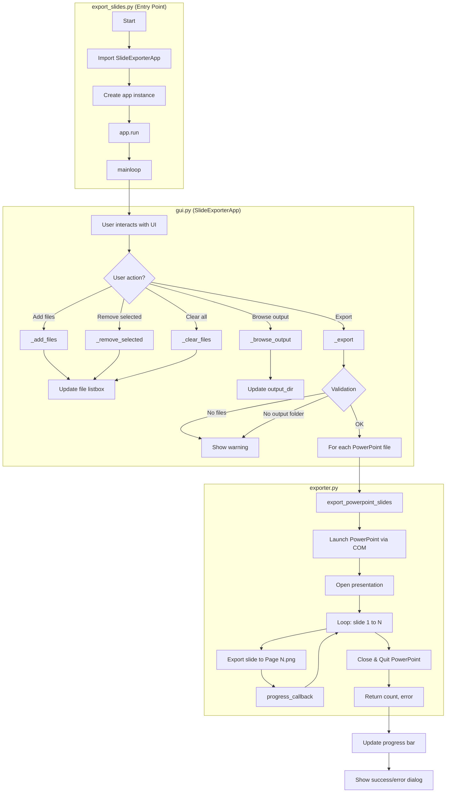
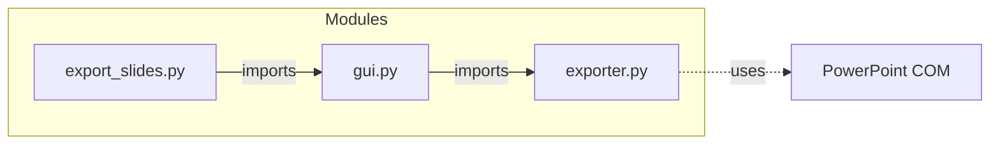
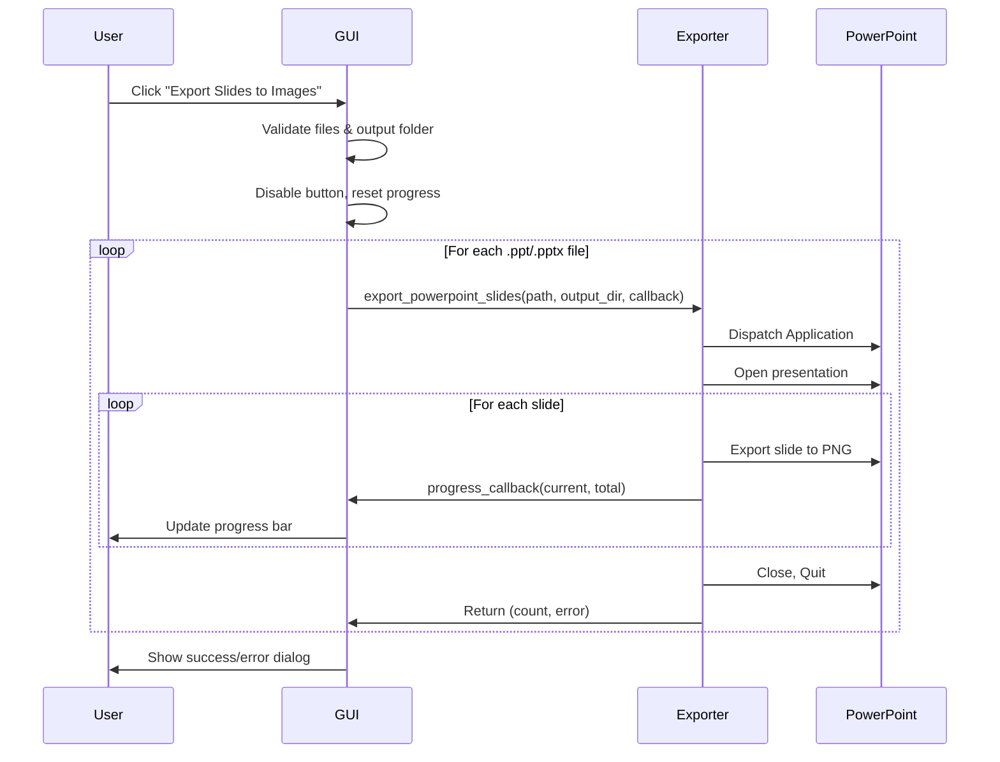

# PowerPoint Slide Exporter — Architecture & Flow

## Mindmap: How the Program Works

```mermaid
mindmap
  root((PowerPoint Slide Exporter))
    Entry Point
      export_slides.py
      Imports SlideExporterApp
      Creates app instance
      Runs mainloop
    GUI Layer
      SlideExporterApp
        File Selection
          Add file(s) button
          Remove selected
          Clear all
          Listbox + scrollbar
        Output
          Folder path entry
          Browse button
        Progress
          Status label
          Progress bar
        Export
          Validate inputs
          Call exporter per file
          Update progress
          Show dialogs
    Export Logic
      export_powerpoint_slides
        Check pywin32
        Validate paths
        Launch PowerPoint COM
        Open presentation
        Loop slides 1 to N
          Export to Page N.png
          Call progress callback
        Cleanup
          Close presentation
          Quit PowerPoint
    Output
      Subfolder per file
      Page 1.png, Page 2.png...
```

---

## Modularization Recommendation

**Current structure is appropriate for this scale.** Further splitting would add files and indirection without clear benefit:

- **exporter.py** (~80 lines) — Single responsibility, easy to test
- **gui.py** (~150 lines) — One cohesive UI class
- **export_slides.py** — Minimal entry point

Splitting further (e.g., separate `file_selector.py`, `progress.py`) would create many small modules with tight coupling. Consider more modularization only if the app grows (e.g., multiple export formats, batch presets, or a plugin system).

---

## Program Flow Diagram



---

## Module Dependency Graph



---

## Data Flow (Export Sequence)



---

## File Structure

```
export-powerpoint-slides-to-images/
├── export_slides.py    # Entry point: creates app, runs mainloop
├── gui.py              # SlideExporterApp: UI, file selection, export orchestration
├── exporter.py         # export_powerpoint_slides(): COM-based slide export
├── requirements.txt
├── README.md
└── ARCHITECTURE.md     # This file
```

---

## Component Responsibilities

| Component | Responsibility |
|-----------|----------------|
| **export_slides.py** | Bootstrap: import GUI, instantiate, run |
| **gui.py** | File selection, output folder, progress display, validation, calling exporter |
| **exporter.py** | PowerPoint COM automation, slide export to PNG, error handling |
