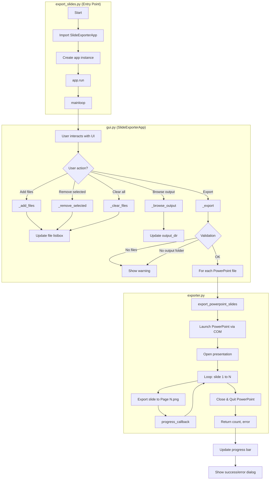

# PowerPoint Slide to Image Exporter

A simple Python GUI application that exports PowerPoint slides to PNG images. Each slide is saved as **Page 1.png**, **Page 2.png**, and so on.

## Requirements

- **Windows** with **Microsoft PowerPoint** installed
- Python 3.8+

## Installation

```bash
pip install -r requirements.txt
```

## Usage

Run the application:

```bash
python export_slides.py
```

1. Click **Add file(s)...** to select one or more PowerPoint files (.ppt or .pptx)
2. Choose an output folder (or use the default)
3. Click **Export Slides to Images**

Each presentation gets its own subfolder in the output directory (named after the file), containing `Page 1.png`, `Page 2.png`, etc.

## Program Flow Diagram


