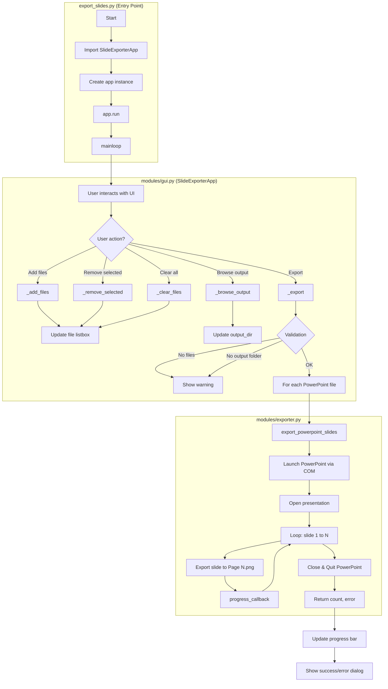

# PowerPoint File to Image Exporter

A Python GUI tool that exports each slide from a PowerPoint file as a PNG image.

Built to quickly turn educational slides into images for use in Readwise flashcards, without digging through PowerPoint export settings.

## Project Description

### What the application does

Select one or more `.ppt`/`.pptx` files and export every slide to `Page 1.png`, `Page 2.png`, etc., in a dedicated output folder per presentation.

### Motivation for building it

I wanted a fast, low-friction way to convert educational slides into images for Readwise flashcards.

### The problem it solves

PowerPoint can export slides, but this makes it quicker: pick a file, click export, and get consistent image output without extra steps.

### Technologies used

- Python 3.8+
- Tkinter (built-in GUI)
- `pywin32` for PowerPoint COM automation
- Microsoft PowerPoint (installed on Windows)

### Possible future improvements

- Better GUI and UX polish
- Image optimization options

## Features

- Simple GUI for selecting one or many presentations
- Exports all slides to PNG images
- Creates a clean subfolder per presentation

## Installation

### Dependencies

- Windows with Microsoft PowerPoint installed
- Python 3.8+

### Step-by-step

```bash
pip install -r requirements.txt
```

## Usage

### Run the app

```bash
python export_slides.py
```

Each presentation exports to its own subfolder containing `Page 1.png`, `Page 2.png`, etc.

## Program Flow Diagram




## Contributing

Contributions are welcome.

1. Fork the repo
2. Create a feature branch
3. Commit your changes
4. Open a pull request

## Credits

- GPT 5.2 Codex
- Cursor

## AI Assistance Disclosure

This project was developed with the assistance of AI tools. AI was used to help generate code suggestions, documentation, and implementation ideas.

All AI-generated content was reviewed, tested, and modified by the author before being included in this repository. The author maintained a human-in-the-loop (HITL) workflow, meaning that AI outputs were treated as suggestions and not accepted without verification.

The author remains fully responsible for the design, implementation, and correctness of the final code.

## License

MIT License.